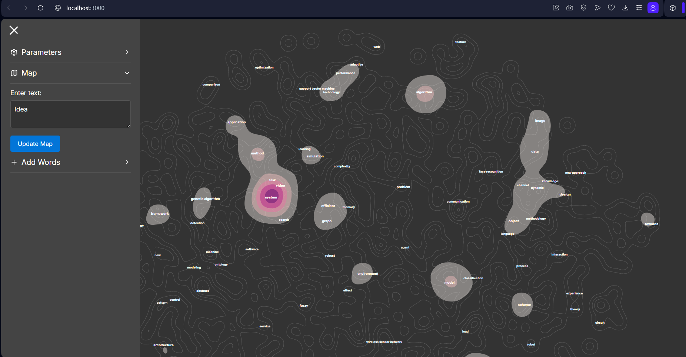
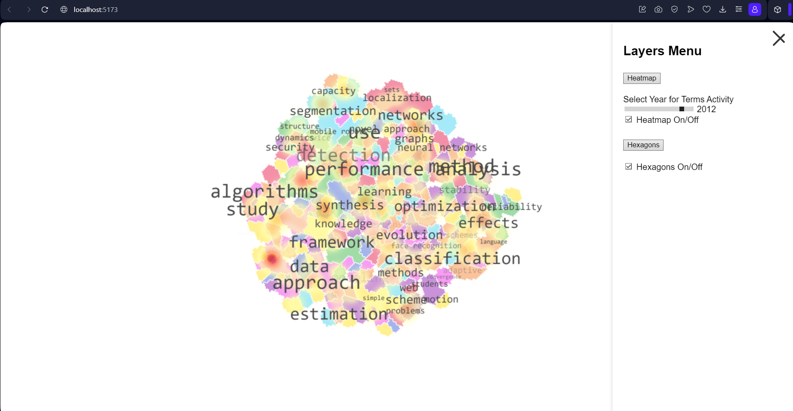

# Vis2

The task is represented by two versions, that are implemented in two different frameworks and have some small differences in implementation.

The original task is to reproduce the visualization techinque used in [Maps of Computer Science](http://ieeexplore.ieee.org/stamp/stamp.jsp?tp=&arnumber=6787157).

In basis the task can be decomposed into 5 parts:

- Text embedding and preprocessing.

- Clusters creation.

- Basemap rendering.

- Heatmap rendering.

- Adding a realtime task.

We deliver two solutions:

- Advanced RTVis

- Basic Vis

In a nutshell they are following the same pipeline:

Text corpus -> POS Filtering -> TFIDF calculation and filtering -> Embed to vector space by Word2Vec -> UMAP.

The key differences are:

- Advanced uses the FastAPI as the backend to serve the Realtime calculations, Basic is static.

- Advance uses pertained Word2Vec, Basic trains it on data.

- Basic uses NN clustering to map the regions, Advanced is uses bins to map the 'hight' of the map.

## Advanced ReTVis 

Prominent features

- Better performance 

- Word addition

- Live text evaluation

- Wide customization

### How to run Advanced ReTVis

In one console open:

Go to `rtvis/python`

> py main.py

And wait for downloading.

In second console:

Go to `rtvis`

> npm install

Wait for installation.

> npm run dev

## Basic Vis 

Prominent features

- Closer to Original map.

### How to run

> npm install

Wait for installation.

> npm start